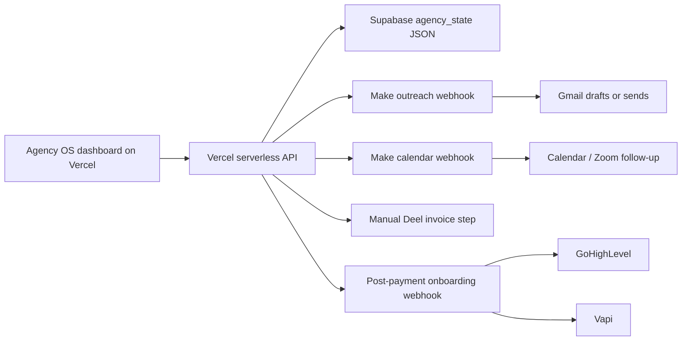

# Live Architecture

Manual approval is the default safety mode.

In Manual approval:

- Queue generation works.
- CRM updates work.
- Copy-ready messages work.
- Buttons update status locally.
- Make webhooks are not called.

In Webhook auto-send:

- Outreach can call Make.
- Calendar actions can call Make.
- Onboarding can call Make.
- You must test every scenario before switching.
